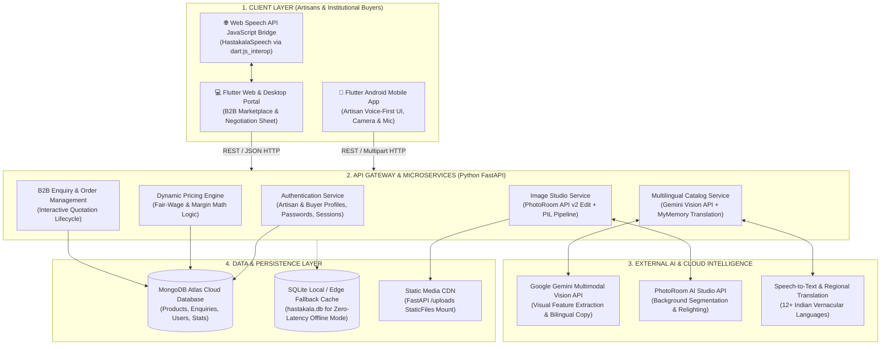
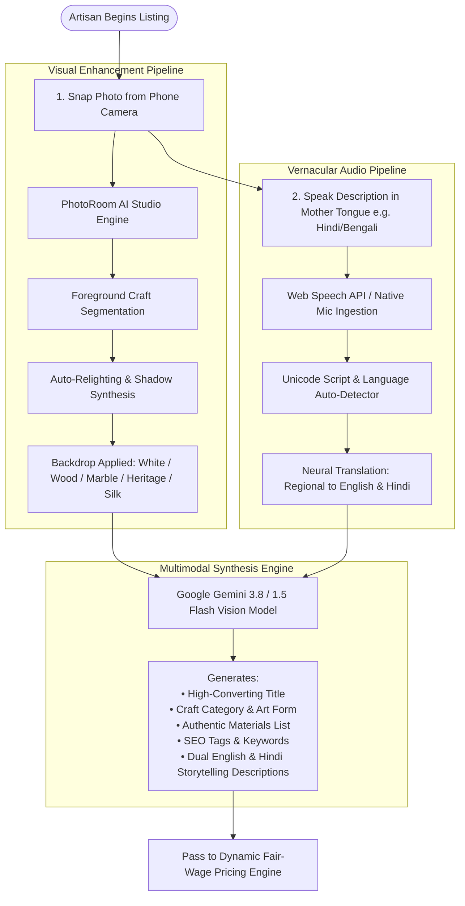
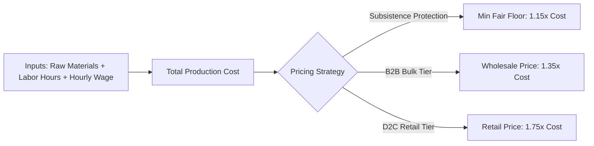

<div align="center">

# 🎨 HASTAKALA (हस्तकला)
### *AI-Powered Business Manager & B2B Marketplace for Traditional Indian Artisans*

**Smart India Hackathon 2026 (SIH 2026)**  
**Problem Statement ID:** `SIH26090` | **Team Name:** `MIND-FORGE`

[](https://www.sih.gov.in/)
[](https://flutter.dev)
[](https://fastapi.tiangolo.com)
[](https://deepmind.google/technologies/gemini/)
[](https://www.mongodb.com/cloud/atlas)
[](https://developer.mozilla.org/en-US/docs/Web/API/Web_Speech_API)
[](https://sih-26090-hastakala-ai-mind-forge-8.vercel.app)

<br/>

> **"Empowering India's grassroots master artisans with voice-first vernacular AI, studio-grade visual cataloging, fair-wage price protection, and direct access to bulk B2B procurement without predatory middlemen."**

</div>

---

## 📑 Table of Contents
1. [Executive Summary & Problem Statement](#-executive-summary--problem-statement)
2. [The Core Challenges](#-the-core-challenges-faced-by-indian-artisans)
3. [The Hastakala Solution](#-the-hastakala-solution)
4. [Key Features & Capabilities](#-key-features--capabilities)
5. [System Architecture](#-system-architecture)
6. [Multimodal AI & Image Studio Pipeline](#-multimodal-ai--image-studio-pipeline)
7. [Dynamic Pricing & Fair-Wage Engine](#-dynamic-pricing--fair-wage-engine)
8. [Technology Stack](#-technology-stack)
9. [Project Directory Structure](#-project-directory-structure)
10. [REST API Endpoints Reference](#-rest-api-endpoints-reference)
11. [Installation & Setup Guide](#-installation--setup-guide)
12. [Environment Variables](#-environment-variables)
13. [SIH Alignment & Government Initiatives](#-sih-alignment--government-initiatives)
14. [Future Roadmap](#-future-roadmap)
15. [Team & Contact](#-team--contact)

---

## 📌 Executive Summary & Problem Statement

* **Problem Statement ID:** `SIH26090`
* **Theme:** Smart Automation / Agriculture, FoodTech & Rural Development / Heritage & Culture
* **Domain:** Empowering Traditional Craftspersons, Handloom Weavers & Rural Artisans
* **Target Audience:** Grassroots Indian Artisans, Self-Help Groups (SHGs), Craft Clusters, Corporate Gifting Buyers, Exporters, and Government Procurement Agencies (GeM, Tribes India).

India's traditional handicraft and handloom sector is the **second-largest employer after agriculture**, sustaining over 7 million rural craftspersons. Despite creating world-renowned heritage crafts (e.g., Banarasi Silk, Dokra Metalcraft, Terracotta Pottery, Madhubani Art, Bamboo Weaving), artisans remain trapped in economic vulnerability due to technological exclusion, language barriers, and exploitation by intermediaries.

**Hastakala** bridges this digital divide through an **inclusive, voice-first, multilingual AI business companion and direct B2B marketplace**. With zero required computer literacy, an artisan simply takes a photo, speaks about their craft in their mother tongue, and lets multimodal AI transform raw workshop snapshots into e-commerce-ready studio listings with fair, algorithmically guaranteed pricing.

---

## ⚠️ The Core Challenges Faced by Indian Artisans

```
┌─────────────────────────┐     ┌─────────────────────────┐     ┌─────────────────────────┐
│  Digital & Language     │     │  Unfair Pricing & Wage  │     │   Predatory Middlemen   │
│        Barriers         │     │       Exploitation      │     │      & Intermediaries   │
│ • Complex text forms    │     │ • Artisans undersell    │     │ • Middlemen capture     │
│ • English-centric apps  │     │ • No transparent labor  │     │   60–80% of final price │
│ • Lack of tech literacy │     │   cost calculation      │     │ • Zero artisan branding │
└─────────────────────────┘     └─────────────────────────┘     └─────────────────────────┘
             ▲                               ▲                               ▲
             └───────────────────────┬───────┴───────────────────────────────┘
                                     │
                     CHALLENGES SOLVED BY HASTAKALA
```

1. **Digital Illiteracy & Complex Interfaces:** Existing e-commerce seller portals (Amazon, Flipkart, Shopify) require typing, metadata entry, and English proficiency that rural artisans lack.
2. **Poor Product Presentation:** Artisans capture photos inside dimly lit, cluttered rural workshops, resulting in low conversion rates against mass-manufactured factory goods.
3. **Unfair Pricing & Middlemen Hegemony:** Intermediaries capture 60% to 80% of consumer retail value while artisans receive below-subsistence daily wages.
4. **Disconnection from B2B Bulk Buyers:** Artisans lack access to institutional buyers (Government e-Marketplace, FabIndia, corporate gifting houses) who purchase in volume.

---

## 💡 The Hastakala Solution

Hastakala introduces an end-to-end technology ecosystem designed specifically for the operational reality of grassroots artisans:

* 🗣️ **Voice-First Vernacular Cataloging:** Speak naturally in Hindi, Bengali, Gujarati, Tamil, etc. Web Speech API + Neural Translation captures product details seamlessly.
* 📸 **AI Studio Enhancement:** Instant background removal and studio relighting via PhotoRoom AI transforms workshop photos into pristine commercial assets.
* 🤖 **Google Gemini Multimodal Vision AI:** Automatically identifies materials, motifs, craft classifications, and writes high-converting bilingual (English + Hindi) descriptions.
* ⚖️ **Dynamic Fair-Wage Engine:** Enforces minimum fair wage floors based on raw material costs and handcrafting labor hours, preventing distress selling.
* 🤝 **Direct B2B Negotiation Portal:** Corporate buyers post bulk enquiries (MOQ, target price, custom design specs) and negotiate directly with artisans via an in-app quotation sheet.
* 🏛️ **AI Business Assistant:** Educates artisans about PM Vishwakarma Yojana, Shilp Samagam, GeM onboarding, and market trend forecasts.

---

## ✨ Key Features & Capabilities

| Feature | Description | Target User |
| :--- | :--- | :--- |
| **Dual Role Authentication** | Segregated registration & login portals for **Artisans** (craft type, location, profile) and **Corporate Buyers** (organization, GST/PAN verification, MOQ preferences). | Artisans & Buyers |
| **Vernacular Voice Input** | Live browser and mobile speech recognition streaming interim transcripts in regional Indian languages. | Artisans |
| **PhotoRoom AI Studio** | 1-click background removal and studio backdrop synthesis (`Pristine White`, `Rustic Wood`, `Smooth Marble`, `Indian Heritage`, `Royal Silk`). | Artisans |
| **Bilingual Multimodal Cataloging** | Google Gemini Vision AI auto-generates SEO titles, bullet points, tags, and dual English/Hindi copy. | Artisans |
| **Smart Pricing Assistant** | Interactive sliders calculating production cost, labor wage floor, wholesale B2B pricing ($1.35\times$), and retail pricing ($1.75\times$). | Artisans |
| **B2B Wholesale Marketplace** | Filter products by craft category, minimum order quantity (MOQ), monthly production capacity, and custom packaging support. | Corporate Buyers |
| **Live Quotation Negotiation** | In-app modal negotiation sheet allowing artisans to accept, counter-offer, or reject bulk buyer bids transparently. | Artisans & Buyers |
| **Offline Resilience** | Hybrid database architecture (MongoDB Atlas Cloud + SQLite Local Cache) allowing uninterrupted work even in low-connectivity rural belts. | Artisans |

---

## 🏗️ System Architecture

Hastakala utilizes a decoupled, modern 4-tier microservices architecture:



---

## 🔬 Multimodal AI & Image Studio Pipeline



---

## 💰 Dynamic Pricing & Fair-Wage Engine

Traditional artisans are often pressured into selling products below subsistence rates. Hastakala prevents this through a **transparent, algorithmic fair-wage formula**:

$$\text{Base Labor Cost} = \text{Labor Hours} \times \text{Labor Rate per Hour (₹)}$$

$$\text{Total Production Cost} = \text{Raw Material Cost} + \text{Base Labor Cost}$$

$$\text{Wholesale Price (B2B Bulk, 10+ Units)} = \text{Total Production Cost} \times 1.35$$

$$\text{Suggested Retail Price (D2C E-Commerce)} = \text{Total Production Cost} \times 1.75$$

$$\text{Minimum Fair Price Floor (Subsistence Protection)} = \text{Total Production Cost} \times 1.15$$



---

## 💻 Technology Stack

### Frontend & Client Applications
* **Framework:** **Flutter 3.x (Dart 3.3+)** — Cross-platform UI supporting Android, Web, and iOS from a single codebase.
* **Web Languages:** **Dart** & **JavaScript (ES6+)**
* **JavaScript Interop:** 
  * Direct browser speech recognition bridge in [`web/index.html`](hastakala_flutter/web/index.html) (`window.HastakalaSpeech` using HTML5 `SpeechRecognition`).
  * Modern **`dart:js_interop`** bindings in [`speech_service_web.dart`](hastakala_flutter/lib/services/speech_service_web.dart).
* **Rendering & Design:** Flutter Material 3 with custom Indian Heritage Color Palette (Wine `#7A0B2E`, Gold `#D8A54A`, Coral `#E87872`, Cream `#FFF8F0`).
* **Web Engine:** CanvasKit / WebAssembly + PWA Service Workers.

### Backend & Microservices
* **Language & Framework:** **Python 3.10+**, **FastAPI**, **Uvicorn** (Asynchronous ASGI server).
* **Data Validation & Schemas:** **Pydantic v2** (`BaseModel`).
* **Image Processing:** **Pillow (PIL)** for dimensions, thumbnails, dominant color sampling, and fallback image enhancements.
* **HTTP Clients:** `httpx` and `requests`.

### Databases & Persistence
* **Cloud Database:** **MongoDB Atlas** (`pymongo`, `dnspython`, `certifi`) — Cloud-hosted NoSQL document database storing products, users, enquiries, and orders.
* **Edge / Offline Database:** **SQLite 3** (`hastakala.db`) — Local embedded relational database providing seamless offline fallback.
* **Media Storage:** FastAPI `StaticFiles` mount at `/uploads`.

### AI Models & Cloud APIs
* **Vision & Generative Copy:** **Google Gemini Multimodal Vision API** (`gemini-3.8-flash` / `gemini-1.5-flash`).
* **Computer Vision Studio:** **PhotoRoom AI API** (v2 Edit & v1 Segment endpoints).
* **NLP & Translation:** **MyMemory API** with Unicode script boundary detection across 12+ Indian languages (Hindi, Bengali, Gujarati, Marathi, Tamil, Telugu, Kannada, Malayalam, Punjabi, Odia, Assamese, Urdu).

### DevOps & Deployment
* **Cloud Platform:** **Vercel Serverless Functions** (`@vercel/python` for FastAPI + `@vercel/static` for Flutter Web).
* **Production Deployment:** Live at [https://sih-26090-hastakala-ai-mind-forge-8.vercel.app](https://sih-26090-hastakala-ai-mind-forge-8.vercel.app).
* **Localhost Runner:** `run_localhost.py` / `run_localhost.bat`.

---

## 📂 Project Directory Structure

```text
SIH26090-HASTAKALA_AI-MIND-FORGE/
│
├── README.md                                  # Root SIH & GitHub Documentation (This file)
├── sih_presentation_charts/                  # High-res downloadable presentation flowcharts
│   ├── 1_Hastakala_System_Architecture_Flowchart.jpg
│   ├── 2_Hastakala_Methodology_Pipeline_Flowchart.jpg
│   ├── 3_Hastakala_Pricing_Negotiation_Flowchart.jpg
│   └── index.html                             # Interactive download gallery
│
└── hastakala_flutter/                         # Main Application Directory
    ├── pubspec.yaml                           # Flutter dependencies & asset configuration
    ├── requirements.txt                       # Python dependencies for backend
    ├── vercel.json                            # Vercel serverless routing & build rules
    ├── run_localhost.py                       # Automated dual-server local runner script
    ├── run_localhost.bat                      # Windows one-click local launch batch file
    │
    ├── api/                                   # Vercel Serverless Function entrypoint
    │   ├── index.py                           # Imports FastAPI app instance for Vercel
    │   └── requirements.txt
    │
    ├── lib/                                   # Flutter Application Source Code
    │   ├── main.dart                          # App entrypoint, theme, router, and screens
    │   ├── screens/                           # Feature screens & UI components
    │   │   ├── artisan_enquiries_page.dart    # Artisan B2B order & negotiation inbox
    │   │   ├── b2b_enquiry_sheet.dart         # Buyer bulk quotation & custom spec sheet
    │   │   ├── buyer_auth_page.dart           # Buyer registration & authentication
    │   │   ├── buyer_home_screen.dart         # Buyer dashboard navigation hub
    │   │   ├── buyer_marketplace_page.dart    # B2B product catalog & search filters
    │   │   └── buyer_orders_page.dart         # Corporate order tracking page
    │   └── services/                          # Client API & hardware services
    │       ├── api_service.dart               # REST client connecting to FastAPI backend
    │       ├── speech_service.dart            # Cross-platform speech abstraction
    │       ├── speech_service_stub.dart       # Mobile / default speech stub
    │       └── speech_service_web.dart        # Dart-JS Interop for browser Web Speech API
    │
    ├── web/                                   # Flutter Web client resources
    │   ├── index.html                         # Host page & HastakalaSpeech JavaScript bridge
    │   ├── manifest.json                      # PWA Web manifest
    │   └── flutter_bootstrap.js
    │
    ├── hastakala_backend/                     # FastAPI Backend Microservices
    │   ├── config.py                          # Environment settings, keys, and paths
    │   ├── database.py                        # MongoDB Atlas & SQLite hybrid data layer
    │   ├── main.py                            # FastAPI app, CORS, routes & controllers
    │   └── services/                          # Core intelligence engines
    │       ├── assistant_service.py           # AI business advisor chat logic
    │       ├── catalog_service.py             # Gemini Multimodal Vision & translation
    │       ├── image_service.py               # PhotoRoom AI studio background engine
    │       └── pricing_service.py             # Dynamic fair-wage pricing engine
    │
    └── assets/                                # Bundled static graphics & imagery
        └── images/
            ├── hastakala_logo.png             # Official Hastakala brand emblem
            └── artisan_art.jpg
```

---

## 📡 REST API Endpoints Reference

The FastAPI backend provides full Swagger UI documentation at `/docs` (or live at `https://sih-26090-hastakala-ai-mind-forge-8.vercel.app/docs`).

| Method | Endpoint | Description | Key Parameters |
| :--- | :--- | :--- | :--- |
| `GET` | `/` or `/api` | Root health check, database status & API info. | None |
| `POST` | `/api/auth/register` | Register a new artisan account. | `full_name`, `username`, `phone`, `craft_type`, `password` |
| `POST` | `/api/auth/login` | Artisan login authentication. | `username`, `password` |
| `POST` | `/api/auth/buyer/register` | Register a corporate wholesale buyer. | `organization_name`, `username`, `phone`, `buyer_type` |
| `POST` | `/api/auth/buyer/login` | Buyer login authentication. | `username`, `password` |
| `POST` | `/api/image/enhance` | AI background removal & studio relighting. | `file` (Multipart), `bg_style`, `bg_prompt` |
| `POST` | `/api/translate` | Vernacular regional text translation. | `text`, `source_lang`, `target_lang` |
| `POST` | `/api/catalog/generate` | Gemini Vision multimodal catalog generation. | `voice_text`, `language`, `image_url` |
| `POST` | `/api/pricing/calculate` | Dynamic fair-wage and wholesale pricing engine. | `category`, `raw_material_cost`, `labor_hours` |
| `GET` | `/api/products` | Retrieve published products (with filters). | `artisan_id`, `category`, `search` |
| `POST` | `/api/products` | Publish a new product listing. | Product metadata JSON body |
| `GET` | `/api/enquiries` | List B2B bulk purchase enquiries. | `artisan_id`, `buyer_id`, `product_id` |
| `POST` | `/api/enquiries` | Submit a B2B quotation enquiry with custom specs. | Quantity, Target Price, Custom specs |
| `PATCH` | `/api/enquiries/{id}/status` | Accept, counter-offer, or reject B2B enquiry. | `status`, `rejection_reason` |
| `POST` | `/api/assistant/chat` | AI business advisor for artisan queries. | `query`, `language` |

---

## 🚀 Installation & Setup Guide

### Prerequisites
* **Flutter SDK:** Version 3.3.0 or higher ([Install Flutter](https://docs.flutter.dev/get-started/install))
* **Python:** Version 3.10 or higher ([Install Python](https://www.python.org/downloads/))
* **Git:** Installed and configured

### 1. Clone the Repository
```bash
git clone https://github.com/saikat-sarkar19/SIH26090-HASTAKALA_AI-MIND-FORGE.git
cd SIH26090-HASTAKALA_AI-MIND-FORGE/hastakala_flutter
```

### 2. Backend Setup
```bash
# Create and activate Python virtual environment
python -m venv venv
# Windows:
venv\Scripts\activate
# Linux/macOS:
source venv/bin/activate

# Install Python requirements
pip install -r requirements.txt

# Start the FastAPI backend server
uvicorn hastakala_backend.main:app --host 0.0.0.0 --port 8000 --reload
```
The backend will be live at `http://127.0.0.1:8000` with interactive API documentation at `http://127.0.0.1:8000/docs`.

### 3. Frontend Setup (Flutter)
Open a separate terminal window in `hastakala_flutter`:
```bash
# Fetch Flutter package dependencies
flutter pub get

# Run on Chrome (Web)
flutter run -d chrome

# Run on connected Android Device / Emulator
flutter run -d android
```

### 4. One-Click Local Launch (Windows)
You can launch both the backend server and Flutter web client simultaneously:
```bash
# Simply double click or run:
run_localhost.bat
# or
python run_localhost.py
```

---

## 🔑 Environment Variables

Create a `.env` file inside `hastakala_flutter/` or configure the following variables in `hastakala_backend/config.py`:

```env
# Google Gemini Multimodal Vision API Key
GEMINI_API_KEY="your-gemini-api-key-here"
GEMINI_MODEL="gemini-3.8-flash"

# PhotoRoom AI Studio API Key
PHOTOROOM_API_KEY="your-photoroom-api-key-here"

# MongoDB Atlas Cloud URI
MONGODB_URI="mongodb+srv://<username>:<password>@cluster0.d7y3jzy.mongodb.net/hastakala_db?retryWrites=true&w=majority"
MONGODB_DB_NAME="hastakala_db"

# Server Host & Port
HOST="0.0.0.0"
PORT=8000
```

---

## 🇮🇳 SIH Alignment & Government Initiatives

Hastakala directly supports and aligns with flagship Government of India initiatives:

* 🔨 **PM Vishwakarma Scheme:** Empowers traditional craftspeople through toolkit digitalization, access to subsidized credit, and marketing support.
* 🏛️ **Government e-Marketplace (GeM):** Pre-formats artisan product data for seamless public procurement by government ministries and PSUs for corporate gifting.
* 🌐 **Open Network for Digital Commerce (ONDC):** Architecture ready to integrate with ONDC handicraft seller protocols to decentralize e-commerce.
* 🌿 **Vocal for Local & Atmanirbhar Bharat:** Bridges rural heritage producers with mainstream domestic and global buyers without intermediaries.

---

## 🗺️ Future Roadmap

- [x] Voice-First Vernacular Product Onboarding (Hindi, Bengali, Tamil, etc.)
- [x] Multimodal Gemini Vision AI Catalog & Tag Generator
- [x] PhotoRoom AI Studio Background Removal & Relighting
- [x] Algorithmic Fair-Wage Dynamic Pricing Engine
- [x] B2B Quotation Negotiation & Custom Order Sheet
- [x] MongoDB Atlas Cloud Sync with SQLite Local Offline Cache

---

## 👥 Team & Contact

**Team Name:** MIND-FORGE  
**Hackathon:** Smart India Hackathon 2026 (SIH 2026)  
**Problem Statement ID:** `SIH26090`

* **Repository:** [https://github.com/saikat-sarkar19/SIH26090-HASTAKALA_AI-MIND-FORGE](https://github.com/saikat-sarkar19/SIH26090-HASTAKALA_AI-MIND-FORGE)
* **Live Deployment:** [https://sih-26090-hastakala-ai-mind-forge-8.vercel.app](https://sih-26090-hastakala-ai-mind-forge-8.vercel.app)

---

<div align="center">
  <sub>Built with ❤️ for Indian Master Artisans by <b>Team Mind-Forge</b> | Smart India Hackathon 2026</sub>
</div>